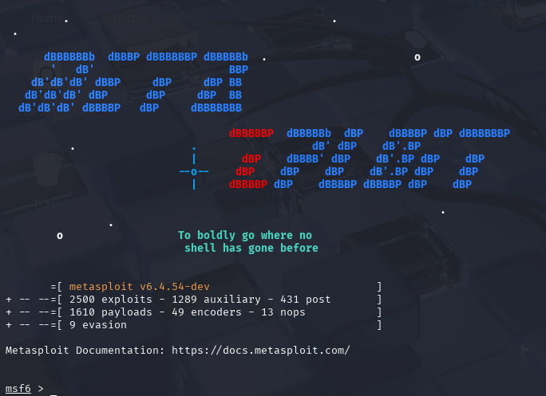

# Inicialización Correcta de Metasploit

Ya sabes qué es Metasploit Framework y por qué es una herramienta esencial en la Ciberseguridad ofensiva. Pero antes de lanzar la consola y empezar a buscar _exploits_, debes asegurarte de que la herramienta esté funcionando a su máxima capacidad.

Metasploit no trabaja solo. Para almacenar hosts, servicios, _exploits_ utilizados, sesiones activas y credenciales (información vital en un _pentest_), requiere una base de datos de apoyo.

Dominar la inicialización correcta es el primer paso para un trabajo profesional y ordenado. Aquí te explico los componentes clave y cómo ponerlos en marcha.

***

### 1. Los Servicios de _Backend_: La Base de Datos

Para el funcionamiento óptimo de Metasploit, dos componentes son esenciales:

* PostgreSQL: Este es el motor de base de datos relacional estándar que Metasploit utiliza para el almacenamiento persistente de todos los datos recopilados durante tu sesión de _pentesting_.
* MSF Database (`msfdb`): Este componente actúa como un intermediario. Es la herramienta que configura y gestiona la conexión entre Metasploit y PostgreSQL, habilitando funcionalidades avanzadas como la importación de resultados de Nmap.

> Importante: Si PostgreSQL no está activo y configurado con `msfdb`, la base de datos no podrá usarse y muchas funcionalidades cruciales de Metasploit (como `db_nmap`, `hosts`, y la persistencia de datos) quedarán inhabilitadas.

***

### 2. Puesta en Marcha: Tres Pasos para Iniciar Metasploit

Asumiremos que estás utilizando un entorno de Linux (como Kali Linux) donde estos comandos son estándar:

#### Paso 1: Iniciar el Servicio de PostgreSQL

Como ya mencionamos, PostgreSQL debe estar activo para que Metasploit registre sus resultados.

```bash
# Comando para iniciar el servicio:
sudo systemctl start postgresql
```

Una vez ejecutado, es buena práctica verificar que el servicio se haya levantado correctamente:

```bash
# Comando para verificar el estado:
sudo systemctl status postgresql
```

Salida esperada: La salida debe mostrar una línea similar a `Active: active (exited) [...]`, indicando que el servicio está listo.

_(Si deseas detener el servicio después de tu sesión de trabajo, usa: `sudo systemctl stop postgresql`)_

#### Paso 2: Inicializar la Base de Datos de Metasploit (`msfdb`)

Este paso es crucial, especialmente si es la primera vez que utilizas Metasploit o si has migrado de versión. El servicio `msfdb` configura las tablas necesarias en PostgreSQL y establece la conexión:Bash

```bash
# Inicializar msfdb (usar solo la primera vez o si hay problemas):
sudo msfdb init
```

El comando `init` configurará automáticamente el acceso de Metasploit a PostgreSQL, creará los esquemas necesarios y se asegurará de que todo esté en orden.

Para verificar que la conexión se haya establecido correctamente:

```bash
# Comando para verificar el estado de msfdb:
msfdb status
```

Salida esperada: Debes ver la confirmación `Database Status: Connected`.

_(Si deseas apagar la conexión con `msfdb`, puedes usar: `sudo msfdb stop`)_

#### Paso 3: Iniciar Metasploit Framework Console

Una vez que has confirmado que PostgreSQL está activo y que `msfdb` reporta el estado Connected, ya estás listo para lanzar el entorno interactivo del Framework:

```bash
# Comando para iniciar la consola:
msfconsole
```

Durante el proceso de carga inicial, Metasploit realizará varias tareas importantes:

* Verificación de la base de datos (confirmando la conexión que acabas de establecer).
* Carga de miles de módulos auxiliares, _exploits_, _payloads_ y _post módulos_.
* Mostrará el _banner_ de bienvenida (que suele cambiar en cada ejecución).

***

**Salida esperada:**

<figure><figcaption></figcaption></figure>

¡Felicidades! Al ver el _prompt_ de `msf>`, ya tienes una sesión de Metasploit lista para trabajar de forma profesional y con capacidad de persistencia de datos.

> Puedes cambiar el banner cuantas veces quieras con el comando:

```bash
banner
```
