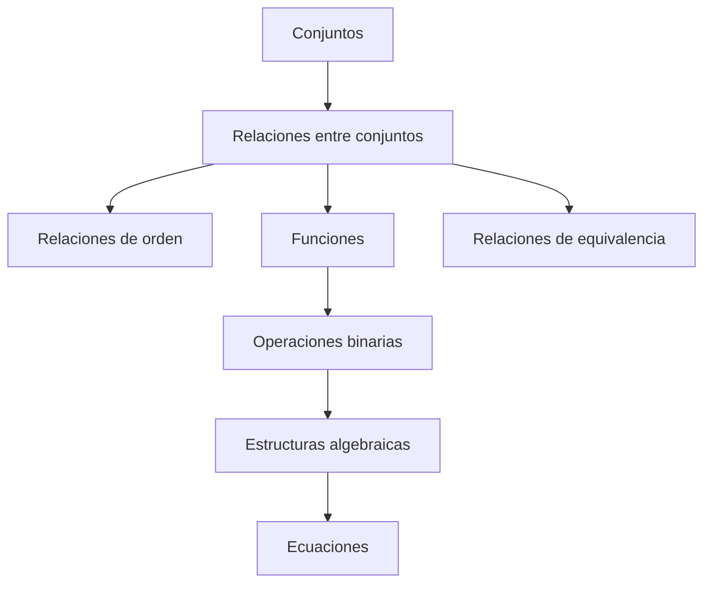

# Fundamentos de Estructuras Algebraicas

Para abordar el estudio de las estructuras algebraicas, es necesario establecer una jerarquía clara que parte desde la teoría de conjuntos hasta llegar a las ecuaciones. El siguiente esquema resume el camino lógico que seguiremos:

Fragmento de código




En forma general y abstracta, podemos expresar una operación cualquiera designando los elementos con letras $a, b, c, \dots$ y las operaciones con signos arbitrarios tales como: $\ast$ (estrella), $\Delta$ (delta), $\circ$ (círculo), etc.

Entonces, la expresión general de una operación binaria es:

$$a \ast b = c$$

En la cual $a$, $b$ y $c$ son elementos de cualquier naturaleza (matemática o no) y la operación $\ast$ es arbitraria. Se lee: "$a$ estrella $b$ es igual a $c$".

### 1. Ley de composición interna

Las operaciones que consideramos son funciones que a cada par ordenado $(a, b)$ de elementos de un conjunto, le hacen corresponder otro elemento $c$ del mismo conjunto. Llamamos a estas operaciones **Leyes de Composición Interna**.

> **Definición:** Una ley de composición interna definida en un conjunto $C$ es una función que, a ciertos pares ordenados de elementos de $C$, hace corresponder un elemento único del mismo conjunto $C$ llamado _compuesto_ de los elementos del par.

El conjunto de todos los pares ordenados de $C$ es el producto cartesiano $C \times C$. Entonces, matemáticamente, una ley de composición interna es una aplicación:

$$f: C \times C \longrightarrow C$$

Ejemplo con la adición en los Naturales:

$$+: \mathbb{N} \times \mathbb{N} \longrightarrow \mathbb{N}$$

$$(3, 2) \longmapsto 5$$

> **Nota para programadores:** En términos computacionales, una ley de composición interna es análoga a una función tipada que recibe dos argumentos del tipo `T` y retorna un valor del mismo tipo `T`.
>
> Python
>
> ```
> def operacion(a: int, b: int) -> int:
>     return a + b
> ```

### 2. Propiedades de una ley de composición interna

Analicemos las propiedades fundamentales utilizando dos ejemplos paralelos: la multiplicación usual en los Racionales $(\mathbb{Q}, \cdot)$ y una operación abstracta "estrella" en un conjunto $C$ denotada como $(C, \ast)$.

| **N°** | **Propiedad**                | **Multiplicación en Q: (Q,⋅)**                                                                                            | **Operación en C: (C,∗)**                                                    |
| ------ | ---------------------------- | ------------------------------------------------------------------------------------------------------------------------- | ---------------------------------------------------------------------------- |
| **1**  | **Ley de Cierre (Clausura)** | Si $\frac{2}{3} \in \mathbb{Q}$ y $\frac{1}{2} \in \mathbb{Q} \Rightarrow (\frac{2}{3} \cdot \frac{1}{2}) \in \mathbb{Q}$ | $\forall a, b \in C \Rightarrow (a \ast b) \in C$                            |
| **2**  | **Ley Asociativa**           | $(\frac{1}{2} \cdot \frac{3}{5}) \cdot \frac{1}{4} = \frac{1}{2} \cdot (\frac{3}{5} \cdot \frac{1}{4})$                   | $(a \ast b) \ast c = a \ast (b \ast c)$                                      |
| **3**  | **Elemento Neutro**          | <p>El neutro es el $1$:<br><br><br><br>$\frac{3}{4} \cdot 1 = 1 \cdot \frac{3}{4} = \frac{3}{4}$</p>                      | <p>Existe $e \in C$ tal que:<br><br><br><br>$a \ast e = e \ast a = a$</p>    |
| **4**  | **Elemento Inverso**         | <p>$\frac{4}{3}$ es el inverso de $\frac{3}{4}$:<br><br><br><br>$\frac{3}{4} \cdot \frac{4}{3} = 1$</p>                   | <p>Existe $a' \in C$ tal que:<br><br><br><br>$a \ast a' = a' \ast a = e$</p> |
| **5**  | **Ley Conmutativa**          | $\frac{2}{3} \cdot \frac{4}{5} = \frac{4}{5} \cdot \frac{2}{3}$                                                           | $a \ast b = b \ast a$                                                        |
| **6**  | **Elemento Absorbente**      | <p>El absorbente es el $0$:<br><br><br><br>$\frac{3}{4} \cdot 0 = 0$</p>                                                  | <p>Existe $s \in C$ tal que:<br><br><br><br>$a \ast s = s \ast a = s$</p>    |

#### 7. Ley uniforme

Dado que las leyes de composición interna son funciones, a un par de elementos le corresponde un resultado único. Decimos que cumplen la ley uniforme:

$$a = b \Rightarrow a \ast c = b \ast c$$

Esto significa: **pares iguales dan resultados iguales**.

#### 8. Ley cancelativa y Elementos regulares

La recíproca de la ley uniforme no siempre es cierta. Definimos la regularidad como la capacidad de simplificar un elemento en una igualdad.

* Si $(a \ast c = b \ast c) \Rightarrow a = b$, se dice que $c$ es **regular a la derecha**.
* Si $(c \ast a = c \ast b) \Rightarrow a = b$, se dice que $c$ es **regular a la izquierda**.

Un elemento es **regular** (o simplificable) cuando lo es a izquierda y derecha. Si _todos_ los elementos de $C$ son regulares, la operación cumple la **ley cancelativa**.

Ejemplo de no regularidad:

En la multiplicación en $\mathbb{Q}$, el cero ($0$) no es regular.

$$x \cdot 0 = 5 \cdot 0$$

Esta igualdad no implica que $x = 5$. La igualdad se verifica para cualquier $x$ (si $x=7$, $0=0$; si $x=12$, $0=0$). Por tanto, $(\mathbb{Q}, \cdot)$ no cumple la ley cancelativa globalmente, pero $(\mathbb{Q} - {0}, \cdot)$ sí la cumple.

> **Importante:** Antes de simplificar (cancelar) un elemento en una ecuación abstracta, debes asegurarte de que sea regular.

#### 9. Ley distributiva

La ley distributiva vincula **dos** operaciones definidas en un mismo conjunto. Sean las operaciones $\ast$ y $\Delta$ en el conjunto $C$.

Si se cumple que:

$$(a \ast b) \Delta c = (a \Delta c) \ast (b \Delta c)$$

Decimos que la operación $\Delta$ distribuye a la operación $\ast$ por la derecha.

Si la distribución se realiza en ambos sentidos (izquierda y derecha), decimos simplemente que se cumple la **propiedad distributiva**.

Ejemplo clásico: En $(\mathbb{Q}, +, \cdot)$, la multiplicación distribuye a la adición:

$$(\frac{2}{5} + \frac{1}{3}) \cdot \frac{3}{4} = (\frac{2}{5} \cdot \frac{3}{4}) + (\frac{1}{3} \cdot \frac{3}{4})$$

#### 10. Ley de idempotencia

Se dice que una ley es idempotente cuando operar un elemento consigo mismo da como resultado el mismo elemento.

$$\forall a \in C, \quad a \ast a = a$$

**Ejemplo:** La unión de conjuntos es idempotente ($A \cup A = A$), pero la suma numérica no lo es ($5 + 5 \neq 5$).
